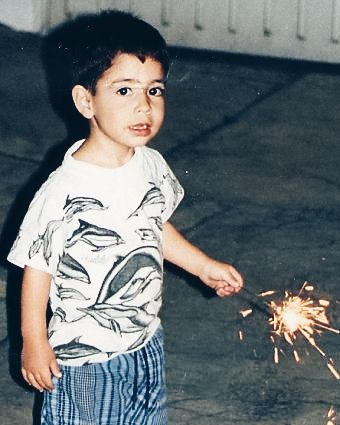

# Building A Personal Site — A Complete Programming Walkthrough

This guide explains how to build this site from scratch, in the order you would actually write it. Every design decision, algorithm, and technique is explained in full detail. No prior knowledge of D3 or SVG geometry is assumed.

---

## Table of Contents

1. [**Project philosophy and file structure**](#1-project-philosophy-and-file-structure)
2. [**HTML skeleton and layout**](#2-html-skeleton-and-layout)
3. [**CSS design system**](#3-css-design-system)
4. [**The panel switching system**](#4-the-panel-switching-system)
5. [**Each panel, one by one**](#5-each-panel-one-by-one)
6. [**The Spanish language toggle**](#6-the-spanish-language-toggle)
7. [**The D3 flight animation**](#7-the-d3-flight-animation)
8. [**The espresso extraction dial**](#8-the-espresso-extraction-dial)
9. [**The glitch and net-art layer**](#9-the-glitch-and-net-art-layer)
10. [**The motto — 諸行無常**](#10-the-motto--諸行無常)
11. [**Entrance animations**](#11-entrance-animations)
12. [**Deployment to GitHub Pages**](#12-deployment-to-github-pages)
13. [**Swapping in real assets**](#13-swapping-in-real-assets)

---

## 1. Project philosophy and file structure

Before writing a single line, it helps to understand the governing constraints, because they explain every decision that follows.

### 1.1 Bauhaus / Dieter Rams principles applied to the web

Dieter Rams distilled good design into ten principles, most of which reduce to: *remove everything that isn't doing necessary work.* Applied to a personal site:

- **One accent colour only** (`#cc3320`, signal red). Everything else is near-black, off-white, or mid-grey. A second accent colour would dilute the signal.
- **No decorative elements other than 1px hairline rules.** No drop shadows, no gradients, no rounded corners, no icons. The hairline rule is the only flourish — and it serves a structural purpose, separating sections and extending index labels.
- **Typography carries all the hierarchy.** Size, weight, case, and tracking do all the work. There are exactly four typographic registers used throughout, described in section 3.3.
- **Visual weight communicates meaning directly.** A solid black chip means *mastered*. An outlined chip means *proficient*. A ghost chip means *exploring*. No numbers, no percentage bars.

### 1.2 Glitch / net-art layer on top

The Bauhaus structure is the skeleton. The glitch effects — scan lines, text scramble, chromatic aberration, cursor trail — are the surface occasionally misbehaving. They are entirely additive: removing section 4 of `main.js` and section 9 of `style.css` restores the clean site completely. Nothing in the core layout depends on them.

The tension between rigorous structure and unstable surface is intentional. The Bauhaus principles enforce discipline; the glitch layer breaks it in controlled ways.

### 1.3 File structure

```
personal-site/
  index.html    — markup only; no inline styles or scripts
  style.css     — all styles, organised by numbered section
  main.js       — all JavaScript, wrapped in a single IIFE
  assets/
    portrait.jpg  — main profile photo (default panel)
    cdmx.jpg      — childhood photo (Mexico City panel)
```

Three files. No build tools, no frameworks, no npm. It opens with `file://` in a browser and deploys by pushing to GitHub.

---

## 2. HTML skeleton and layout

### 2.1 The document head

```html
<!DOCTYPE html>
<html lang="en">
<head>
  <meta charset="UTF-8" />
  <meta name="viewport" content="width=device-width, initial-scale=1.0" />
  <title>Sebastián</title>

  <link rel="preconnect" href="https://fonts.googleapis.com" />
  <link rel="preconnect" href="https://fonts.gstatic.com" crossorigin />
  <link href="https://fonts.googleapis.com/css2?family=IBM+Plex+Mono:wght@300;400&family=IBM+Plex+Sans:wght@300;400;500&display=swap" rel="stylesheet" />

  <link rel="stylesheet" href="style.css" />

  <script src="https://cdnjs.cloudflare.com/ajax/libs/d3/7.8.5/d3.min.js"></script>
</head>
```

**Why `preconnect` for Google Fonts?**
The browser needs to open a TCP connection, perform a TLS handshake, and send an HTTP request before it can download any font file. `preconnect` tells the browser to do all of that work speculatively — before it even knows which fonts are needed — so by the time the CSS `@font-face` declarations are parsed, the connection is already warm. On a cold connection this saves roughly 100–300ms of first-paint latency.

Two separate `preconnect` hints are needed because Google Fonts serves its CSS from `fonts.googleapis.com` but its actual font files from `fonts.gstatic.com`. Without the second hint, the font files themselves would still incur a cold connection.

**Why IBM Plex?**
IBM Plex Sans and IBM Plex Mono were designed as a matched pair: same x-height, compatible optical weight, designed to coexist on the same page without one dominating the other. The distinction between sans (body text, headings) and mono (all labels, codes, indices, captions) creates a clear visual register hierarchy without requiring any size or weight changes.

**Why D3 in `<head>` rather than before `</body>`?**
Normally you'd put scripts before `</body>` to avoid blocking render. But D3 must be available before `main.js` executes, and `main.js` is loaded before `</body>`. If both scripts were at the end, execution order would still be correct. D3 in `<head>` is a defensive choice — it guarantees D3 is defined regardless of how the page is assembled or cached, and the performance cost is negligible for a library served from Cloudflare's CDN.

### 2.2 The two-column layout

```html
<body>
<div class="site">
  <div class="left">   <!-- biography -->  </div>
  <div class="right">  <!-- panels -->     </div>
</div>
```

```css
.site {
  display: grid;
  grid-template-columns: 1fr 1fr;
  height: 100vh;
}

html, body {
  height: 100%;
  overflow: hidden;
}
```

`grid-template-columns: 1fr 1fr` means "divide available width into two equal fractions." Unlike `width: 50%`, fractional units account for gaps and don't overflow their container.

`height: 100vh` makes the grid exactly fill the viewport height. `overflow: hidden` on `html` and `body` enforces the no-scroll rule — the site is deliberately a single screen. There is no content below the fold; everything is accessed through the hover system.

The left column gets `border-right: 1px solid var(--black)` — the only border in the layout. It acts as a visible seam between the two halves.

### 2.3 The hoverable word system

Every interactive word in the biography is a `<span>` with two attributes:

```html
<span class="hl" data-panel="professor">professor</span>
```

`class="hl"` — marks it for styling and event binding. CSS gives it a dotted red underline at rest and a solid red underline when active. JavaScript binds `mouseenter` and `mouseleave` events to the whole set.

`data-panel="professor"` — a `data-*` attribute stores the panel identifier. JavaScript reads `element.dataset.panel` to know which panel to show. The naming convention is direct: `data-panel="professor"` activates `id="panel-professor"`.

This is a clean separation of concerns: the HTML describes *what* the word is connected to; the JavaScript describes *how* that connection behaves; the CSS describes *how it looks*.

### 2.4 The script tag and Cloudflare

```html
<script data-cfasync="false" src="main.js"></script>
</body>
```

The script is placed immediately before `</body>` so the entire DOM is parsed and available before the script executes. `document.querySelectorAll('.hl')` works correctly because every `.hl` element already exists at that point.

`data-cfasync="false"` prevents a Cloudflare-specific problem. When a site sits behind Cloudflare's CDN (common with GitHub Pages through a custom domain), Cloudflare automatically injects an email-obfuscation script before any `<script>` tag it finds. This injected script has two problems: it fails in sandboxed iframes, and it blocks subsequent script execution. Adding `data-cfasync="false"` tells Cloudflare to skip injection for that element.

---

## 3. CSS design system

### 3.1 Custom properties (design tokens)

All values that appear in more than one place live in `:root` as CSS custom properties:

```css
:root {
  --black: #0c0c0c;   /* Near-black — warm, not pure #000  */
  --white: #f4f3ef;   /* Warm off-white — slightly cream   */
  --mid:   #6e6e6e;   /* Mid-grey for secondary labels     */
  --rule:  #d0cfc9;   /* Warm light-grey for hairline rules */
  --red:   #cc3320;   /* Signal red — the single accent    */

  --sans: 'IBM Plex Sans', Helvetica, sans-serif;
  --mono: 'IBM Plex Mono', monospace;
}
```

**Why `#0c0c0c` instead of `#000000`?** Pure black on screen has a harshness that pure black ink on paper does not. `#0c0c0c` is slightly warm, slightly lifted — closer to the appearance of dense ink on off-white stock. The same logic applies to `#f4f3ef` instead of `#ffffff`. The warmth in both values is coordinated so they feel like they belong together.

**Why custom properties over Sass variables?** Custom properties are resolved at runtime, not compile time. This means they work in vanilla CSS without any build step, they can be overridden by media queries or JavaScript, and they appear in the browser's DevTools where you can modify them live.

### 3.2 Reset

```css
*, *::before, *::after {
  box-sizing: border-box;
  margin: 0;
  padding: 0;
}
```

`box-sizing: border-box` changes how `width` and `height` are calculated. By default (content-box), if you set `width: 200px` and then add `padding: 1rem`, the element becomes 232px wide. With `border-box`, the element stays 200px and the content area shrinks to accommodate the padding. This is almost always what you want — it makes layout arithmetic predictable.

`margin: 0; padding: 0` removes browser default spacing. `<h1>` elements have browser-default top/bottom margin; `<p>` elements have browser-default bottom margin. Resetting to zero gives you a blank slate and makes the page behave identically across browsers.

### 3.3 Typography hierarchy

There are exactly four typographic registers. Every text element on the site falls into one of these four buckets:

| Register | Font | Size | Weight | Case | Tracking | Used for |
|---|---|---|---|---|---|---|
| Heading | IBM Plex Sans | `clamp(2.2rem, 4vw, 3.4rem)` | 500 | uppercase | −0.04em | Name, panel titles |
| Body | IBM Plex Sans | `clamp(0.9rem, 1.5vw, 1.25rem)` | 300 | normal | −0.005em | Bio paragraphs |
| Index | IBM Plex Mono | 0.55rem | 400 | uppercase | 0.18em | Section numbers, panel labels |
| Caption | IBM Plex Mono | 0.52–0.58rem | 400 | varies | 0.08–0.14em | Course codes, degree years, footer links |

The `clamp()` function produces fluid font sizes:

```css
font-size: clamp(2.2rem, 4vw, 3.4rem);
```

This reads: *never smaller than 2.2rem, never larger than 3.4rem, scale proportionally to viewport width in between.* At a typical 1440px viewport, `4vw` is 57.6px ≈ 3.6rem, which gets clamped to 3.4rem. At 800px it's 32px ≈ 2rem, which gets clamped up to 2.2rem. The heading scales smoothly between these limits with zero media queries.

**Why tight tracking (negative letter-spacing) on headings?** At large sizes, the default letter-spacing creates visually uneven gaps. Pulling the letters slightly closer together makes the heading read as a single cohesive unit rather than a sequence of individual letters. `−0.04em` is relative to the current font size, so it scales correctly at any size.

**Why wide tracking on mono labels?** Small-caps mono text at 0.55rem needs extra spacing to remain legible at that size. `0.18em` is generous but the short string lengths (e.g., "01 / README.md") mean it never looks spaced-out.

### 3.4 The index strip pattern

The most-reused structural pattern on the site: a small label followed by a hairline rule that extends to fill the remaining width.

```html
<div class="left-index">
  <span class="left-index-label" id="left-index-label">01 / README.md</span>
  <div class="left-index-rule"></div>
</div>
```

```css
.left-index {
  display: flex;
  align-items: center;
  gap: 1rem;
}

.left-index-rule {
  flex: 1;       /* this is the entire trick */
  height: 1px;
  background: var(--rule);
}
```

`flex: 1` is shorthand for `flex-grow: 1; flex-shrink: 1; flex-basis: 0`. The `flex-grow: 1` part tells the browser to give this element all remaining space after the label has been sized. No matter how wide the container is or how long the label is, the rule always extends to the right edge.

The `id="left-index-label"` attribute is also what the glitch layer targets for its periodic corruption effect (see section 8.7).

The same pattern is used inside every right-column panel via a CSS `::after` pseudo-element, avoiding the need for an extra HTML element:

```css
.panel-index {
  display: flex;
  align-items: center;
  gap: 1rem;
}

.panel-index::after {
  content: '';
  flex: 1;
  height: 1px;
  background: var(--rule);
}
```

`content: ''` is required — pseudo-elements don't render without it, even if they're empty strings.

### 3.5 The chip system

Proficiency is communicated through visual weight rather than numbers. Three variants:

```css
/* Fully mastered — maximum visual weight */
.chip-solid {
  background: var(--black);
  color: var(--white);
  border: 1px solid var(--black);
}

/* Working knowledge — present but not filled */
.chip-outline {
  background: transparent;
  color: var(--black);
  border: 1px solid var(--black);
}

/* Early-stage / exploring — minimal presence */
.chip-ghost {
  background: transparent;
  color: var(--mid);
  border: 1px solid var(--rule);
}
```

The base chip is rectangular with no `border-radius`. Bauhaus doesn't round corners — rounded corners imply softness and approachability, which conflicts with the architectural rigour of the aesthetic. Sharp corners read as precise and deliberate.

### 3.6 Panel stacking with `position: absolute; inset: 0`

All right-column panels share the same space using absolute positioning:

```css
.right {
  position: relative;   /* establishes the containing block */
  overflow: hidden;
}

.panel {
  position: absolute;
  inset: 0;             /* shorthand: top: 0; right: 0; bottom: 0; left: 0 */
  opacity: 0;
  pointer-events: none;
}

.panel.active {
  opacity: 1;
  pointer-events: auto;
}
```

`inset: 0` makes every panel fill the entire `.right` div — they're stacked on top of each other like a deck of cards. Only the `.active` one is visible.

`pointer-events: none` on inactive panels is critical. Without it, invisible panels would still intercept mouse events, causing hover and click interactions to trigger on panels the user can't see. Setting `pointer-events: none` makes invisible elements completely transparent to interaction.

---

## 4. The panel switching system

### 4.1 The IIFE wrapper

The entire `main.js` is wrapped in an Immediately Invoked Function Expression:

```javascript
(function () {
  'use strict';
  // ... all code ...
})();
```

**What it does:** Creates a private function scope. Every `var` declared inside is local to this function. None of them become properties of `window`. Without the IIFE, `var hls = ...` would create `window.hls`, `var panels = ...` would create `window.panels`, etc. Any third-party script loaded on the page (D3, analytics, browser extensions) could accidentally read or overwrite them.

**Why `'use strict'`?** Enables strict mode, which catches several classes of common errors at runtime:
- Using an undeclared variable throws a `ReferenceError` instead of silently creating a global
- Assigning to a read-only property throws a `TypeError` instead of failing silently
- Duplicate parameter names throw a `SyntaxError`
- `this` inside functions called without a receiver is `undefined` instead of `window`

**The critical scope rule:** Any code that references variables declared inside the IIFE *must also be inside the IIFE*. Code appended after `})();` is outside the scope and cannot see `hls`, `panels`, `flightRaf`, etc. This was the source of earlier bugs — glitch code was appended outside the IIFE and threw `ReferenceError: hls is not defined`.

### 4.2 Core variables

```javascript
var hls          = document.querySelectorAll('.hl');
var panels       = document.querySelectorAll('.panel');
var defaultPanel = document.getElementById('panel-default');
var flightRaf    = null;
```

`querySelectorAll` returns a static `NodeList` — a snapshot of all matching elements at the moment of the call. Unlike `getElementsByClassName`, it does not update when the DOM changes, which is fine here since the panels never change after page load.

`flightRaf` stores the `requestAnimationFrame` handle for the flight animation. When the user hovers away mid-flight, `reset()` calls `cancelAnimationFrame(flightRaf)` to stop the animation immediately. Without this variable, the plane would continue moving on an invisible panel.

### 4.3 `showPanel` and `reset`

```javascript
function showPanel(id) {
  panels.forEach(function (p) { p.classList.remove('active'); });
  var target = document.getElementById('panel-' + id);
  if (target) {
    target.classList.add('active');
    if (id === 'moved')    { runFlight(); }
    if (id === 'espresso') { initDial();  }
  }
}

function reset() {
  panels.forEach(function (p) { p.classList.remove('active'); });
  defaultPanel.classList.add('active');
  hls.forEach(function (h) { h.classList.remove('active'); });
  if (flightRaf !== null) { cancelAnimationFrame(flightRaf); flightRaf = null; }
}
```

`showPanel` always deactivates *all* panels first, then activates the target. This is simpler and more robust than tracking which panel is currently active and only deactivating that one — no state to get out of sync.

`document.getElementById('panel-' + id)` — the naming convention makes this trivial. `data-panel="professor"` → `id="panel-professor"`. No lookup table needed.

The two `if` branches at the bottom trigger panel-specific side effects: `runFlight()` resets and replays the D3 animation every time "moved" is hovered; `initDial()` rebuilds and initialises the espresso SVG every time "espresso" is hovered. Both are safe to call repeatedly because they clear their SVG targets at the start of each call.

### 4.4 The hover events and the `relatedTarget` fix

```javascript
hls.forEach(function (hl) {

  hl.addEventListener('mouseenter', function () {
    hls.forEach(function (h) { h.classList.remove('active'); });
    hl.classList.add('active');
    showPanel(hl.dataset.panel);
  });

  hl.addEventListener('mouseleave', function (e) {
    var next = e.relatedTarget;
    if (!next || !next.classList || !next.classList.contains('hl')) {
      reset();
    }
  });

});

document.querySelector('.site').addEventListener('mouseleave', reset);
```

The naive implementation — `mouseleave` always calls `reset()` — has a bug. When you move the cursor directly from one `.hl` word to another, the sequence is:

1. `mouseleave` fires on word A → `reset()` called → default panel shown
2. `mouseenter` fires on word B → `showPanel()` called → new panel shown

This causes a single-frame flash of the default panel. The fix uses `e.relatedTarget` — the element the cursor is *entering* — to skip the reset when transitioning between two `.hl` words.

`!next.classList` guards against the case where `relatedTarget` is `null` (cursor left the window entirely) or is a non-element node. The `.site` `mouseleave` listener handles that edge case as a safety net.

### 4.5 `bindHlEvents` — re-wiring after innerHTML swap

The Spanish toggle replaces paragraph innerHTML, which destroys and recreates the `.hl` spans. New DOM elements don't inherit the event listeners attached to their predecessors. `bindHlEvents` re-attaches the panel-switching events to any fresh `.hl` elements after a swap:

```javascript
function bindHlEvents(newHls) {
  newHls.forEach(function (hl) {
    var originalText = hl.textContent;

    hl.addEventListener('mouseenter', function () {
      document.querySelectorAll('.hl').forEach(function (h) { h.classList.remove('active'); });
      hl.classList.add('active');
      showPanel(hl.dataset.panel);
      scrambleText(hl, originalText, 150, 5);
    });

    hl.addEventListener('mouseleave', function (e) {
      var next = e.relatedTarget;
      if (!next || !next.classList || !next.classList.contains('hl')) { reset(); }
      hl.textContent = originalText;
    });
  });
}
```

This is called at the end of `swapBio()`, immediately after `el.innerHTML = newHTML`. It mirrors the original event-binding loop used at page load — the same hover and reset logic, just applied to a new set of nodes.

Note that `bindHlEvents` uses `document.querySelectorAll('.hl')` rather than the cached `hls` NodeList. After a swap, the cached `hls` variable still references the *old* span elements that were removed from the DOM. A fresh `querySelectorAll` always returns what's currently in the document.

---

## 5. Each panel, one by one

### 5.1 Default panel — Bauhaus geometric mark and photo frame

The background SVG is a Bauhaus composition: concentric circles, cross lines, diagonal lines, and a red square at the centre. It renders at 4% opacity as a texture:

```html
<svg viewBox="0 0 120 120" aria-hidden="true">
  <circle cx="60" cy="60" r="58" stroke="#0c0c0c" stroke-width="0.5"/>
  <circle cx="60" cy="60" r="35" stroke="#0c0c0c" stroke-width="0.5"/>
  <circle cx="60" cy="60" r="12" stroke="#0c0c0c" stroke-width="0.5"/>
  <line x1="60" y1="2"   x2="60"  y2="118" stroke="#0c0c0c" stroke-width="0.5"/>
  <line x1="2"  y1="60"  x2="118" y2="60"  stroke="#0c0c0c" stroke-width="0.5"/>
  <line x1="18" y1="18"  x2="102" y2="102" stroke="#0c0c0c" stroke-width="0.5"/>
  <line x1="102" y1="18" x2="18"  y2="102" stroke="#0c0c0c" stroke-width="0.5"/>
  <rect x="55" y="55" width="10" height="10" stroke="#cc3320" stroke-width="0.8"/>
</svg>
```

`aria-hidden="true"` removes the SVG from the accessibility tree. Screen readers would otherwise attempt to describe it, which is meaningless noise. Any purely decorative element should carry this attribute.

The photo frame uses two absolutely positioned divs to create a shadow-border effect without CSS box shadows:

```css
.default-photo-frame  { position: relative; width: 200px; height: 250px; }

.default-photo-shadow {
  position: absolute;
  top: 7px; left: 7px; right: -7px; bottom: -7px;
  border: 1px solid var(--rule);
}
.default-photo-main {
  position: absolute;
  inset: 0;
  border: 1px solid var(--black);
  overflow: hidden;
}
```

`.default-photo-shadow` is offset 7px down and right. Its `right: -7px; bottom: -7px` extend it beyond the frame, making it appear to sit behind and below the main border — a shadow drawn with a hairline rule, consistent with the no-shadows rule.

`overflow: hidden` on `.default-photo-main` clips the `` to the frame boundaries.

### 5.2 Professor panel — courses and institutional affiliation

The course list is a two-column CSS grid with hairline separators:

```css
.course-item {
  display: grid;
  grid-template-columns: 7rem 1fr;
  border-top: 1px solid var(--rule);
  padding: 0.85rem 0;
  align-items: baseline;
}

.course-item:last-child { border-bottom: 1px solid var(--rule); }
```

`align-items: baseline` aligns the two columns on their text baseline rather than their top edges — this looks more typographically correct when the columns have different font sizes or weights.

The affiliation footer uses a middot separator:

```html
<div class="prof-affil">
  <span class="prof-affil-item">NYU Tandon</span>
  <span class="prof-affil-dot">&middot;</span>
  <span class="prof-affil-item">NYU Courant</span>
</div>
```

`&middot;` (`·`) is a centered dot used conventionally to separate items of equal status. The CSS colours it in `var(--rule)` — lighter than the text on either side — so it reads as a pause rather than punctuation.

### 5.3 Developer and music panels — chip rows

Both panels use the same chip row structure: a fixed-width tier label on the left, a wrapping group of chips on the right:

```css
.chip-row {
  border-top: 1px solid var(--rule);
  padding: 0.85rem 0;
  display: flex;
  align-items: center;
  gap: 1rem;
}

.chip-row-label {
  width: 5.5rem;
  flex-shrink: 0;    /* prevents label from squishing if chips wrap */
}

.chip-items {
  display: flex;
  flex-wrap: wrap;
  gap: 0.45rem;
}
```

`flex-shrink: 0` on the label is important. Flexbox will try to shrink all items proportionally when space is tight. The label should stay at its fixed width; only the chips should wrap. `flex-shrink: 0` opts it out of the shrinking algorithm.

`flex-wrap: wrap` on `.chip-items` allows chips to flow onto a new line if the panel is too narrow — responsive layout without media queries.

### 5.4 Language panels — Japanese, Czech, Classical Latin

Each panel follows the same structure: a large ghosted initial letter, an index label, a translated bio paragraph, and footer links in the target language.

The `.lang-badge` is a large character positioned in the top-right corner at 4% opacity. `aria-hidden="true"` marks it decorative — it's redundant with the `lang-index` label above it.

`.lang-word` highlights the translated equivalent of the bio's trigger word in red with a red border-bottom. It's a visual callback to the `.hl` underline system — the same word, in a different language, with the same visual weight.

### 5.5 Contact panel

Three links styled as full-width rows with the handle right-aligned:

```css
.contact-link {
  display: flex;
  justify-content: space-between;
  align-items: baseline;
  border-top: 1px solid var(--rule);
  padding: 0.95rem 0;
  text-decoration: none;
  color: var(--black);
  transition: color 0.12s;
}

.contact-link:hover { color: var(--red); }
```

`justify-content: space-between` pushes the platform name to the left and the handle to the right. `align-items: baseline` aligns the two on their text baselines — important because the platform name is larger than the handle.

---

## 6. The Spanish language toggle

Spanish is the native language — not a translation panel in the same mould as Japanese, Czech, or Latin, but the actual voice of the site. The feature is a small `ES★ / EN` button in the bottom-right corner of the left column. Clicking it rewrites all four bio paragraphs in place, using the text scramble effect, and flips the toggle state immediately.

### 6.1 Why this approach rather than another language panel

The other language panels (Japanese, Czech, Latin) show a *snapshot* — a static translation, reached by hovering a word. They are things you peek at. Spanish is different: it's where Sebastián comes from, so switching to it should feel like switching the mode of the entire left column, not opening a side drawer.

The toggle pattern communicates this. It replaces the source text, restructures the sentences, and changes the language of every interactive element — the panel trigger words, the links, the contact paragraph — so the site functions in Spanish, not just displays it.

### 6.2 The HTML structure

Each bio paragraph gets a stable `id` so the JS can target it directly:

```html
<p class="bio" id="bio-1">
  I am a Brooklyn-based computer science
  <span class="hl" data-panel="professor">professor</span> ...
</p>
<p class="bio" id="bio-2">...</p>
<p class="bio" id="bio-3">...</p>
<p class="bio" id="bio-4">...</p>
```

The toggle button sits in the bottom-right of the left column, mirroring the footer links on the bottom-left:

```html
<button class="lang-toggle" id="lang-toggle" aria-label="Switch bio language">
  <span class="lang-toggle-native">ES&#9733;</span>
  <span class="lang-toggle-sep">/</span>
  <span class="lang-toggle-other" id="lang-toggle-other">EN</span>
</button>
```

`&#9733;` is a filled star (`★`). It marks ES as native — a permanent marker, not an active-state indicator. The active state is communicated by colour, not by which label has the star.

### 6.3 The CSS state system

There are two independent signals on the toggle: which language is native (permanent) and which is currently active (changes on click):

```css
/* ES★ — grey when reading English, black when reading Spanish */
.lang-toggle-native       { color: var(--mid); }
.lang-toggle-native.active { color: var(--black); }

/* EN — black when reading English, grey when reading Spanish */
.lang-toggle-other        { color: var(--black); }
.lang-toggle-other.dimmed  { color: var(--mid); }

/* Both turn red on hover */
.lang-toggle:hover .lang-toggle-native,
.lang-toggle:hover .lang-toggle-other { color: var(--red); }
```

The result: whichever language you're currently reading is black; the other is grey. The star on `ES` is just a permanent marker of native status and never changes. On hover both sides turn red together, treating the button as a single interactive unit.

This avoids the earlier bug where `ES` was always red, making it *look* active even when the site was displaying English — red read as "active" not "native".

### 6.4 The bio content data

Both language versions are stored as arrays of HTML strings — one entry per paragraph:

```javascript
var BIO_EN = [
  'I am a Brooklyn-based computer science <span class="hl" data-panel="professor">professor</span> ...',
  'Although I mostly deal in the <a class="bio-link" href="...">introductory</a> ...',
  'Outside of work, some of my interests involve ...',
  'Students can schedule office hours with me ...'
];

var BIO_ES = [
  'Soy <span class="hl" data-panel="professor">profesor</span> y <span class="hl" data-panel="developer">programador</span> de ciencias de la computación en Brooklyn ...',
  'Aunque me dedico principalmente a la pedagogía de programación <a class="bio-link" href="...">introductoria</a> ...',
  'Fuera del trabajo, entre mis intereses se encuentran el <span class="hl" data-panel="lang-ja">aprendizaje</span> ...',
  'Los estudiantes pueden programar horas de oficina <a class="bio-link" href="...">aquí.</a> ...'
];
```

Each entry is a full HTML string, not plain text. This is necessary because the paragraphs contain `.hl` spans with `data-panel` attributes and `.bio-link` anchors — the panel-switching system depends on these being present and correctly attributed in whichever language is displayed. The Spanish versions use Spanish words as the trigger text ("profesor", "programador", "mudé") while keeping the same `data-panel` values, so hovering Spanish words activates the same right-column panels.

### 6.5 `swapBio` — scramble then inject HTML

```javascript
function swapBio(el, newHTML, delay) {
  var originalText = el.textContent;
  var duration = 320, steps = 8, stepMs = duration / steps, frame = 0;

  setTimeout(function () {
    var interval = setInterval(function () {
      frame++;

      if (frame >= steps) {
        el.innerHTML = newHTML;
        clearInterval(interval);
        bindHlEvents(el.querySelectorAll('.hl'));
        return;
      }

      var progress = frame / steps;
      var scrambled = originalText.split('').map(function (ch, i) {
        if (ch === ' ' || ch === ',' || ch === '.') return ch;
        if (progress > (originalText.length - i) / originalText.length) return ch;
        return GLITCH_CHARS[Math.floor(Math.random() * GLITCH_CHARS.length)];
      }).join('');

      el.textContent = scrambled;
    }, stepMs);
  }, delay);
}
```

The scramble runs on `el.textContent` — the plain text of the current paragraph, stripped of all HTML tags. This means the scramble shows readable-looking character noise rather than visible `<span class="hl"...>` angle brackets, which would look ugly and also confuse the character-width calculation.

Only on the final frame is `el.innerHTML = newHTML` called. This atomically replaces the paragraph with the fully structured HTML version — all spans, links, and `data-panel` attributes are restored in one operation. Immediately after, `bindHlEvents` re-attaches the panel-switching event listeners to the new `.hl` nodes (see section 4.5).

The `delay` parameter staggers the four paragraphs: 0ms, 80ms, 160ms, 240ms. This creates a cascading scramble effect that reads left-to-right, top-to-bottom through the biography, rather than all four paragraphs exploding at once.

### 6.6 The click handler

```javascript
toggleBtn.addEventListener('click', function () {
  var targetLang = (bioLang === 'en') ? 'es' : 'en';
  var targetBio  = (targetLang === 'es') ? BIO_ES : BIO_EN;

  /* Update state and toggle appearance immediately — before any scramble */
  bioLang = targetLang;
  if (targetLang === 'es') {
    toggleOther.classList.add('dimmed');
    toggleNative.classList.add('active');
  } else {
    toggleOther.classList.remove('dimmed');
    toggleNative.classList.remove('active');
  }

  /* Stagger the four paragraph swaps */
  BIO_IDS.forEach(function (id, i) {
    var el = document.getElementById(id);
    if (el) { swapBio(el, targetBio[i], i * 80); }
  });
});
```

**Why update the toggle immediately rather than after the scramble finishes?** The scramble takes ~640ms to complete across all four paragraphs. If the toggle only updated at the end, clicking would appear to do nothing for over half a second — a confusing dead zone. Updating `bioLang` and the visual classes on the first line of the handler means the toggle flips the instant the user clicks, and the scramble that follows is confirmatory feedback rather than primary feedback.

`bioLang` is also updated immediately for the same reason: if the user clicks again mid-scramble, the toggle should correctly flip back rather than getting stuck in an inconsistent state.

---

## 7. The D3 flight animation

D3 (Data-Driven Documents) is a JavaScript library for binding data to SVG elements and animating transitions. Here it handles one specific task: drawing and animating a curved flight path from Mexico City to New York.

### 6.1 Why D3 rather than plain SVG?

For this animation, D3 adds three things plain SVG/JS doesn't have out of the box:

1. **Transition system** — `.transition().duration(2200).ease(d3.easeCubicInOut).attr(...)` handles the stroke-dashoffset animation with easing in one chain.
2. **`d3.easeCubicInOut`** — a mathematically correct easing function.
3. **Delayed transitions** — `.transition().delay(2200)` lets the city markers fade in exactly when the path arrives, without manual `setTimeout` chains.

The plane animation still uses `requestAnimationFrame` directly (because it needs frame-by-frame position access via `getPointAtLength`), but the path and markers use D3's transition system throughout.

### 6.2 Setting up and clearing the SVG

```javascript
function runFlight() {
  var el = document.getElementById('flight-svg');
  var W  = el.clientWidth  || 500;
  var H  = el.clientHeight || 400;

  var svg = d3.select(el);
  svg.selectAll('*').remove();
```

`el.clientWidth` and `el.clientHeight` give the rendered pixel dimensions of the SVG element. The `|| 500` fallback handles the case where the panel is hidden and the browser returns 0.

`svg.selectAll('*').remove()` clears everything drawn in previous runs. `runFlight()` is called on every hover of "moved". Without this line, each re-trigger would add new paths, markers, and labels on top of the previous ones.

### 6.3 The background engineering grid

```javascript
var grid = svg.append('g').attr('opacity', 0.06);

for (var x = 0; x < W; x += 40) {
  grid.append('line')
    .attr('x1', x).attr('y1', 0)
    .attr('x2', x).attr('y2', H)
    .attr('stroke', '#0c0c0c').attr('stroke-width', 0.5);
}
```

All grid lines are grouped in a `<g>` element with `opacity: 0.06`. Setting opacity on the group rather than on each line means a single attribute controls all of them — cleaner and more performant than setting opacity on every individual line.

At 6% opacity the grid is subliminal — you perceive depth and structure without consciously seeing a grid. This is a technique borrowed from engineering drawings and graph paper.

### 6.4 The Bézier curve flight path

```javascript
var mx  = { x: W * 0.28, y: H * 0.68 };  // Mexico City
var ny  = { x: W * 0.72, y: H * 0.28 };  // New York

var cpx = (mx.x + ny.x) / 2;
var cpy = Math.min(mx.y, ny.y) - H * 0.32;

var trail = svg.append('path')
  .attr('d', 'M' + mx.x + ',' + mx.y + ' Q' + cpx + ',' + cpy + ' ' + ny.x + ',' + ny.y)
```

City positions are proportional to SVG dimensions so they scale correctly regardless of panel size.

A **quadratic Bézier curve** is defined by three points: start, end, and one control point. The SVG path command `Q cx,cy x,y` draws a curve from the current position to `(x,y)` with control point `(cx,cy)`. The control point pulls the curve toward itself without the curve actually passing through it — like a magnet bending a wire.

`cpy = Math.min(mx.y, ny.y) - H * 0.32` places the control point above both cities (lower y = higher on screen in SVG coordinates), creating the characteristic arc of a flight path.

### 6.5 The stroke-dashoffset drawing animation

This is a CSS trick applied via D3. Every SVG stroke can have a dash pattern: `stroke-dasharray: 500` creates one dash exactly 500px long. `stroke-dashoffset: 500` shifts that dash 500px backwards, making it invisible. Animating `stroke-dashoffset` from 500 to 0 slides the dash forward until it covers the path — which looks exactly like the path drawing itself in real time.

```javascript
var pathLength = trail.node().getTotalLength();

trail
  .attr('stroke-dasharray',  pathLength)
  .attr('stroke-dashoffset', pathLength)
  .transition()
    .duration(2200)
    .ease(d3.easeCubicInOut)
    .attr('stroke-dashoffset', 0);
```

`getTotalLength()` is a native SVG DOM method that returns the arc length of any `<path>` element. Using it ensures the dash length always exactly matches the path.

`d3.easeCubicInOut` applies cubic easing — the animation accelerates for the first third, runs at full speed in the middle, and decelerates for the last third. This matches the natural rhythm of real aircraft and feels more physical than a linear animation.

### 6.6 City markers with staggered reveal

```javascript
cg.append('rect')
  .attr('opacity', 0)
  .transition()
    .delay(i ? 2200 : 100)
    .duration(200)
    .attr('opacity', 1);
```

`i ? 2200 : 100` uses the ternary operator: Mexico City (index 0) appears after 100ms (almost immediately), New York (index 1) appears after 2200ms — exactly when the path animation completes and the plane arrives. Square markers are used rather than circles, consistent with the site's rectilinear geometric language.

### 6.7 The `requestAnimationFrame` plane animation

```javascript
function animatePlane(timestamp) {
  if (!startTime) startTime = timestamp;

  var elapsed  = timestamp - startTime;
  var progress = Math.min(elapsed / 2200, 1);
  var eased    = d3.easeCubicInOut(progress);

  var pt  = pathNode.getPointAtLength(eased * pathLength);
  var pt2 = pathNode.getPointAtLength(Math.min(eased * pathLength + 2, pathLength));

  var angle = Math.atan2(pt2.y - pt.y, pt2.x - pt.x) * 180 / Math.PI;

  plane
    .attr('transform', 'translate(' + pt.x + ',' + pt.y + ') rotate(' + angle + ')')
    .attr('opacity', (progress > 0.02 && progress < 0.98) ? 1 : 0);

  if (progress < 1) {
    flightRaf = requestAnimationFrame(animatePlane);
  } else {
    flightRaf = null;
  }
}
```

`requestAnimationFrame` calls `animatePlane` before each screen repaint. The `timestamp` argument is a high-precision millisecond value. Using timestamps rather than frame counts makes the animation framerate-independent — the plane completes in exactly 2200ms on any display refresh rate.

`getPointAtLength(n)` returns the SVG coordinate `{x, y}` at distance `n` along the path. Two points are sampled 2px apart to compute the heading angle: `Math.atan2(dy, dx)` computes the angle of the vector between them. Note the argument order is `(y, x)` — this is a standard trigonometry convention.

The `opacity` toggle hides the plane at the very start and end (`progress < 0.02` or `progress > 0.98`), so it doesn't pop in abruptly at the origin or freeze visibly at the destination.

`flightRaf` stores the `requestAnimationFrame` handle. When `reset()` calls `cancelAnimationFrame(flightRaf)`, the next scheduled frame is cancelled — the plane disappears mid-flight when the user hovers away.

---

## 8. The espresso extraction dial

The espresso panel is the most complex single piece of the site — a fully interactive SVG instrument built without any library, rendered entirely by JavaScript on each panel activation.

### 7.1 The data model

The dial maps a `0–1` float to three extraction zones defined by SCA (Specialty Coffee Association) parameters:

```javascript
var ZONES = [
  {
    min: 0, max: 0.30,
    label: 'UNDER-EXTRACTED',
    lines: ['EXT%  < 18.0', 'ACIDITY  HIGH', 'BODY     THIN', 'FINISH   SHORT']
  },
  {
    min: 0.30, max: 0.70,
    label: 'OPTIMAL',
    lines: ['EXT%  18–22', 'ACIDITY  BALANCED', 'BODY     FULL', 'FINISH   CLEAN']
  },
  {
    min: 0.70, max: 1.00,
    label: 'OVER-EXTRACTED',
    lines: ['EXT%  > 22.0', 'ACIDITY  MUTED', 'BODY     DRYING', 'FINISH   BITTER']
  }
];
```

**EXT%** (extraction yield) is the percentage of the coffee's dry mass that has dissolved into the water. Under ~18% yields sour, thin espresso; 18–22% is the SCA optimal range; over ~22% yields bitter, drying espresso.

**TDS** (total dissolved solids) measures the concentration of the final beverage. Espresso optimal range is 8–12%.

### 7.2 SVG geometry — arc coordinates

The dial arc spans 140° from 200° to 340° (measuring clockwise from 3 o'clock = 0°, which is standard SVG/trigonometry convention). This maps to roughly 8 o'clock → 4 o'clock, opening downward.

```javascript
var CX    = 160;   // viewBox centre x
var CY    = 165;   // viewBox centre y — offset downward to give arc more room
var R     = 110;   // arc radius
var START = 200;   // arc start angle in degrees
var END   = 340;   // arc end angle in degrees
var SPAN  = END - START;  // 140° total

function rad(deg) { return deg * Math.PI / 180; }

function arcPt(deg) {
  return {
    x: CX + R * Math.cos(rad(deg)),
    y: CY + R * Math.sin(rad(deg))
  };
}
```

**Converting polar to Cartesian:** A point at angle `θ` and radius `r` from a centre `(cx, cy)` has Cartesian coordinates `(cx + r·cos(θ), cy + r·sin(θ))`. This is fundamental trigonometry used throughout the dial code.

**Why offset `CY` downward to 165?** The arc opens downward through the bottom of the SVG viewBox (200 units tall). Centering at 165 rather than 100 gives more visual space inside the arc for the needle and labels, and less wasted space above it.

### 7.3 Building the arc with SVG path commands

```javascript
svgEl.appendChild(el('path', {
  d: 'M ' + aStart.x + ' ' + aStart.y +
     ' A ' + R + ' ' + R + ' 0 0 1 ' + aEnd.x + ' ' + aEnd.y,
  stroke: '#d0cfc9',
  'stroke-width': '2',
  fill: 'none'
}));
```

The SVG `A` (arc) command syntax is: `A rx ry x-rotation large-arc-flag sweep-flag x y`.

- `rx ry` — x and y radii (equal for a circle)
- `x-rotation` — rotation of the ellipse (0 for circles)
- `large-arc-flag` — 0 = draw the minor arc, 1 = draw the major arc
- `sweep-flag` — 0 = counter-clockwise, 1 = clockwise
- `x y` — end point

`large-arc-flag: 0` and `sweep-flag: 1` draws a clockwise minor arc from start to end. Since our arc spans 140° (less than 180°), it is the minor arc.

**Why use `createElementNS` instead of `innerHTML`?** SVG elements must be created in the SVG namespace (`http://www.w3.org/2000/svg`). `document.createElement('path')` creates an HTML element that renders nothing. `document.createElementNS(NS, 'path')` creates a proper SVG element. The `el()` helper wraps this:

```javascript
var NS = 'http://www.w3.org/2000/svg';
function el(tag, attrs) {
  var e = document.createElementNS(NS, tag);
  Object.keys(attrs).forEach(function (k) { e.setAttribute(k, attrs[k]); });
  return e;
}
```

### 7.4 The needle and SVG transforms

```javascript
var needleGroup = document.createElementNS(NS, 'g');
needleGroup.setAttribute('transform',
  'rotate(' + posToAngle(pos) + ' ' + CX + ' ' + CY + ')');

// Needle shaft — drawn horizontally, then rotated
needleGroup.appendChild(el('line', {
  x1: CX, y1: CY,
  x2: CX + R - 12, y2: CY,
  stroke: '#0c0c0c', 'stroke-width': '1.5'
}));

// Needle tip — small red square
needleGroup.appendChild(el('rect', {
  x: CX + R - 16, y: CY - 3,
  width: '6', height: '6',
  fill: '#cc3320'
}));
```

The needle is drawn *horizontally* — pointing right along the x-axis from the centre. Then the whole group is rotated by the current angle using `transform="rotate(angle cx cy)"`.

`rotate(angle cx cy)` rotates around a specific point `(cx, cy)` rather than the SVG origin. This is essential — rotating around the origin would move the needle off-screen. Rotating around the dial centre keeps it in place while changing its angle.

When the user drags, only the `transform` attribute needs updating:

```javascript
needleGroup.setAttribute('transform',
  'rotate(' + posToAngle(pos) + ' ' + CX + ' ' + CY + ')');
```

No geometry needs to be recalculated. The needle is always horizontal in its own coordinate system; the transform makes it point in the right direction.

### 7.5 Drag interaction with Pointer Events

```javascript
svgEl.addEventListener('pointerdown', function (e) {
  dragging = true;
  svgEl.setPointerCapture(e.pointerId);
});

svgEl.addEventListener('pointermove', function (e) {
  if (!dragging) return;
  pos = eventToPos(e);
  needleGroup.setAttribute('transform',
    'rotate(' + posToAngle(pos) + ' ' + CX + ' ' + CY + ')');
  updateDescriptors(pos);
});
```

**Why Pointer Events instead of Mouse Events?** The Pointer Events API (`pointerdown`, `pointermove`, `pointerup`) unifies mouse, touch, and stylus input. A touch drag on mobile fires `pointermove` events exactly like a mouse drag on desktop — no separate touch event handling required.

**`setPointerCapture`** is the key technique for drag interactions. Normally, dragging the mouse outside the SVG element stops it receiving `pointermove` events. `setPointerCapture(e.pointerId)` tells the browser to route all subsequent pointer events to this element even if the pointer leaves it. This makes the drag feel solid — the needle follows the cursor even when it briefly leaves the dial.

### 7.6 Converting pointer position to dial angle

```javascript
function eventToPos(e) {
  var rect   = svgEl.getBoundingClientRect();
  var scaleX = 320 / rect.width;
  var scaleY = 200 / rect.height;

  var svgX = (e.clientX - rect.left) * scaleX;
  var svgY = (e.clientY - rect.top)  * scaleY;

  var angleDeg = Math.atan2(svgY - CY, svgX - CX) * 180 / Math.PI;
  if (angleDeg < 0) angleDeg += 360;

  var t = (angleDeg - START) / SPAN;
  return Math.max(0, Math.min(1, t));
}
```

The SVG `viewBox` is `"0 0 320 200"` but the rendered element may be any pixel size. `getBoundingClientRect()` gives the actual pixel size. Dividing `320 / rect.width` gives the scale factor to convert screen pixels to viewBox units.

`Math.atan2(dy, dx)` returns an angle in `[−π, π]`. Adding 360 when the result is negative normalises it to `[0, 360)`.

`(angleDeg - START) / SPAN` maps the angle range `[START, END]` to `[0, 1]`. `Math.max(0, Math.min(1, t))` clamps it so dragging outside the arc doesn't produce values below 0 or above 1.

### 7.7 Live extraction percentage

```javascript
function updateDescriptors(t) {
  var zone   = getZone(t);
  var extPct = 16 + t * 10;  // maps 0→16%, 1→26%

  zEl.textContent = zone.label + '  ·  EXT ' + extPct.toFixed(1) + '%';
  nEl.textContent = zone.lines.join('\n');
}
```

`16 + t * 10` linearly interpolates the dial's 0–1 range to a 16–26% extraction yield range. At `t = 0.48` (the default), `EXT = 20.8%` — well inside the optimal zone.

`toFixed(1)` formats the number to one decimal place. Without it, floating-point arithmetic would produce values like `20.799999999998`.

The readout lines use `'\n'` as a separator and `white-space: pre` in CSS to render as a stacked column — mimicking terminal output.

---

## 9. The glitch and net-art layer

All glitch effects live in section 4 of `main.js` and section 9 of `style.css`. They are fully additive — removing them restores the clean Bauhaus site.

### 8.1 CRT scan lines

```css
.right::after {
  content: '';
  position: absolute;
  inset: 0;
  background: repeating-linear-gradient(
    to bottom,
    transparent          0px,
    transparent          2px,
    rgba(0, 0, 0, 0.018) 2px,
    rgba(0, 0, 0, 0.018) 4px
  );
  pointer-events: none;
  z-index: 100;
}
```

`repeating-linear-gradient` tiles its pattern infinitely. The pattern: 2px transparent, 2px very slightly dark (1.8% black), repeat. This produces horizontal stripes 4px tall, mimicking a CRT monitor's scan lines.

At 1.8% opacity the effect is subliminal — viewers perceive texture and a slight analog quality without being able to identify what they're seeing.

`pointer-events: none` is essential — a `::after` pseudo-element covering the entire panel would otherwise intercept all mouse events, blocking interactions with the espresso dial, contact links, etc.

`z-index: 100` places the scan lines above all panel content, so they overlay the text, photos, and SVG elements.

### 8.2 Chromatic aberration on the name heading

```css
.name-heading:hover {
  text-shadow:
    -2px 0 rgba(204, 51, 32, 0.65),   /* red channel, shifted left  */
     2px 0 rgba(0,   0, 145, 0.5);    /* blue channel, shifted right */
  animation: glitch-name 2.4s infinite;
}

@keyframes glitch-name {
  0%, 90%  { text-shadow: -2px 0 rgba(204,51,32,0.65), 2px 0 rgba(0,0,145,0.5); }
  91%      { text-shadow: -4px 0 rgba(204,51,32,0.8),  3px 1px rgba(0,0,145,0.6);
             clip-path: inset(20% 0 60% 0); }
  92%      { text-shadow:  3px 0 rgba(204,51,32,0.8), -3px 0 rgba(0,0,145,0.6);
             clip-path: inset(60% 0 10% 0); }
  93%      { clip-path: none; }
  100%     { text-shadow: -2px 0 rgba(204,51,32,0.65), 2px 0 rgba(0,0,145,0.5); }
}
```

Real chromatic aberration occurs when a lens refracts different wavelengths differently — red light bends slightly differently from blue light, causing colour fringing at high-contrast edges. `text-shadow` creates offset ghost copies of the text in red and blue, simulating this fringing.

For 90% of the hover animation the effect is stable. At the 91% mark it fires a rapid three-frame tearing sequence using `clip-path: inset()`. This command clips the element to a rectangle defined by insets from each edge. `inset(20% 0 60% 0)` shows only the horizontal band from 20% to 40% of the element's height — a thin slice that creates the horizontal tearing effect characteristic of a degraded video signal.

### 8.3 Glitchy panel bar

```css
@keyframes bar-glitch {
  0%   { transform: scaleX(0);    opacity: 1; }
  30%  { transform: scaleX(0.55); opacity: 0.4; }
  31%  { transform: scaleX(0.3);  opacity: 1; }
  55%  { transform: scaleX(0.8);  opacity: 0.6; }
  56%  { transform: scaleX(0.65); opacity: 1; }
  100% { transform: scaleX(1);    opacity: 1; }
}
```

`transform-origin: left` makes `scaleX` expand from the left edge.

The 30%→31% and 55%→56% jumps are single-frame reversals. Because CSS animations interpolate between keyframes, the jump from `scaleX(0.55)` at 30% to `scaleX(0.3)` at 31% is instantaneous (1% of the animation duration = ~4.5ms). It reads as a mechanical stutter — the bar briefly retreats before pushing forward.

### 8.4 Panel wipe transition

```css
.panel.active {
  animation: panel-wipe 0.28s steps(8, end) both;
}

@keyframes panel-wipe {
  0%   { opacity: 0; clip-path: inset(0 100% 0 0); }
  40%  { opacity: 1; clip-path: inset(0 60%  0 0); }
  70%  { opacity: 1; clip-path: inset(0 15%  0 0); }
  85%  { opacity: 1; clip-path: inset(0 25%  0 0); }
  100% { opacity: 1; clip-path: inset(0 0    0 0); }
}
```

`steps(8, end)` divides the animation into 8 equal discrete jumps rather than interpolating smoothly. The animation snaps between states rather than flowing — mimicking a CRT electron beam scanning across the screen one stripe at a time.

`clip-path: inset(0 X 0 0)` clips `X%` from the right edge, revealing the panel from left to right. The 85% keyframe briefly steps back to `25%` (from `15%` at 70%) — a stutter that makes the wipe feel unstable.

### 8.5 Text scramble on hover

```javascript
var GLITCH_CHARS = '!@#$%&?/\\|_-+~^`\'"<>.,:;';

function scrambleText(el, original, duration, steps) {
  var stepMs = duration / steps;
  var frame  = 0;

  var interval = setInterval(function () {
    frame++;
    if (frame >= steps) {
      el.textContent = original;
      clearInterval(interval);
      return;
    }

    var progress = frame / steps;
    var scrambled = original.split('').map(function (ch, i) {
      if (ch === ' ' || ch === ',' || ch === '.') return ch;
      if (progress > (original.length - i) / original.length) return ch;
      return GLITCH_CHARS[Math.floor(Math.random() * GLITCH_CHARS.length)];
    }).join('');

    el.textContent = scrambled;
  }, stepMs);
}
```

`setInterval(fn, stepMs)` fires `fn` every `stepMs` milliseconds, producing a fixed number of frames at a fixed frame rate. `clearInterval` stops it when the scramble completes.

The resolution pattern `progress > (original.length - i) / original.length` resolves characters right-to-left. At 50% progress, the rightmost characters have resolved and the leftmost are still noise. This creates a rightward sweep of resolution that feels more natural than left-to-right (which looks like normal text appearing).

**Why keyboard characters rather than block elements?** Block elements (`▓▒░█`) have widths that differ from alphabetic characters, causing the scrambled word to jump in width and push adjacent words out of position. Keyboard characters like `!@#$%` have similar widths to alphabetic characters and cause no layout shifts.

This function is reused across three contexts with different parameters:
- `.hl` hover words: 150ms, 5 steps (fast, subtle)
- `#left-index-label` corruption: 500ms, 7 steps (moderate)
- `.motto-hex` corruption: 800ms, 10 steps (slow, languorous)

### 8.6 Cursor trail pool

```javascript
var TRAIL_SIZE  = 8;
var TRAIL_DELAY = 30;

var trailPool = [];
for (var ti = 0; ti < TRAIL_SIZE; ti++) {
  var dot = document.createElement('div');
  dot.className = 'cursor-trail';
  document.body.appendChild(dot);
  trailPool.push(dot);
}

document.addEventListener('mousemove', function (e) {
  var now = Date.now();
  if (now - lastTrailTime < TRAIL_DELAY) return;
  lastTrailTime = now;

  var dot = trailPool[trailIndex % TRAIL_SIZE];
  trailIndex++;

  dot.style.left = e.clientX + 'px';
  dot.style.top  = e.clientY + 'px';

  dot.classList.remove('visible');
  void dot.offsetWidth;
  dot.classList.add('visible');
});
```

**Why a pool?** Creating and destroying a `<div>` on every `mousemove` event causes frequent garbage collection pauses. The pool pre-creates 8 elements and recycles them in a ring — `trailIndex % TRAIL_SIZE` wraps back to 0 after index 7. At any given moment, up to 8 dots exist in the DOM; older dots simply fade out and get repositioned when their slot comes up again.

**The `void dot.offsetWidth` trick:** CSS classes are batched by the browser. Removing `.visible` and immediately re-adding it in the same JavaScript task is a no-op — the browser would see only the final state. `void dot.offsetWidth` forces a synchronous layout reflow, flushing the pending class removal to the renderer before the class is added back. Without it, the fade animation would never restart.

`TRAIL_DELAY = 30` throttles dot creation to one per 30ms maximum. Without throttling, fast mouse movement would generate hundreds of events per second.

### 8.7 Periodic index label corruption

```javascript
var indexLabelEl = document.getElementById('left-index-label');

if (indexLabelEl) {
  var indexLabelOriginal = indexLabelEl.textContent;

  function corruptIndexLabel() {
    scrambleText(indexLabelEl, indexLabelOriginal, 500, 7);

    var nextDelay = 5000 + Math.random() * 4000;
    setTimeout(corruptIndexLabel, nextDelay);
  }

  setTimeout(corruptIndexLabel, 4000);
}
```

The `01 / README.md` label in the top-left corrupts briefly every 5–9 seconds. `Math.random() * 4000` adds jitter so the corruption never feels mechanical — it's organic, like a transmission error on a bad connection.

`corruptIndexLabel` calls itself after each corruption via `setTimeout`, creating a self-scheduling loop. This is cleaner than `setInterval` for variable-delay repetition: each invocation sets its own next delay, making the intervals genuinely random.

`if (indexLabelEl)` guards against the function throwing if the element doesn't exist — defensive programming that costs nothing.

### 8.8 Motto hex block corruption

```javascript
function corruptMotto() {
  scrambleText(mottoEl, mottoOriginal, 800, 10);
  setTimeout(corruptMotto, 8000 + Math.random() * 8000);
}

setTimeout(corruptMotto, 7000);
```

The motto hex block uses slower parameters: 800ms duration, 10 steps. The first corruption fires at 7 seconds — offset from the 4-second index label corruption so they never overlap.

The motto is in a `<pre>` element. `el.textContent` returns all text including newlines, and setting `el.textContent = scrambled` preserves the element itself. Spaces and newlines pass through the scramble unchanged, so the ASCII box structure partially persists even mid-corruption.

---

## 10. The motto — 諸行無常

### 9.1 The encoding

The motto is displayed as its raw UTF-8 hex bytes:

```
;;;;;;;;;;;;;;;;;;;;;;;
;; E8 AB B8 E8 A1 8C ;;
;; E7 84 A1 E5 B8 B8 ;;
;;;;;;;;;;;;;;;;;;;;;;;
```

`E8 AB B8` = `諸`. `E8 A1 8C` = `行`. `E7 84 A1` = `無`. `E5 B8 B8` = `常`.

**Why three bytes per character?** UTF-8 is a variable-length encoding. Code points U+0000–U+007F (ASCII) encode to 1 byte. U+0080–U+07FF encode to 2 bytes. U+0800–U+FFFF — which covers the entire CJK Unified Ideographs block — encode to 3 bytes. The four characters of 諸行無常 are all in the U+0800–U+FFFF range: 諸 = U+8AF8, 行 = U+884C, 無 = U+7121, 常 = U+5E38.

The 3-byte UTF-8 encoding follows the bit pattern `1110xxxx 10xxxxxx 10xxxxxx`. For 諸 (U+8AF8 = binary `1000 1010 1111 1000`):
- First byte: `1110` + `1000` = `0xE8`
- Second byte: `10` + `101011` = `0xAB`
- Third byte: `10` + `111000` = `0xB8`

### 9.2 The HTML and CSS

```html
<div class="motto" id="motto">
  <pre class="motto-hex">;;;;;;;;;;;;;;;;;;;;;;;
;; E8 AB B8 E8 A1 8C ;;
;; E7 84 A1 E5 B8 B8 ;;
;;;;;;;;;;;;;;;;;;;;;;;</pre>
  <span class="motto-kanji">諸行無常</span>
</div>
```

`<pre>` (preformatted text) preserves all whitespace literally — spaces, tabs, and newlines are rendered as-is. Without `<pre>`, the browser would collapse the newlines to single spaces and destroy the ASCII art box structure.

```css
.motto {
  position: absolute;
  bottom: 3rem;
  left: 50%;
  transform: translateX(-50%);
}
```

`left: 50%; transform: translateX(-50%)` is the canonical technique for horizontally centring an absolutely positioned element of unknown width. `left: 50%` positions the element's left edge at the horizontal centre. `translateX(-50%)` shifts it left by half its own width. The result: the element's centre is at the container's centre. This works for any element width.

```css
.motto-hex  { color: var(--rule); transition: color 0.2s; }
.motto:hover .motto-hex { color: var(--mid); }

.motto-kanji {
  opacity: 0;
  transform: translateY(5px);
  transition: opacity 0.3s ease, transform 0.3s ease;
}
.motto:hover .motto-kanji {
  opacity: 1;
  transform: translateY(0);
}
```

At rest, the hex is rendered in `--rule` — barely visible. Hovering brightens it and reveals the kanji.

The kanji reveal uses two simultaneous transitions: `opacity` (fade in) and `transform` from `translateY(5px)` to `translateY(0)` (slides up 5px). Using `transform` for the vertical movement instead of `top` or `margin-top` is important for performance: `transform` is composited on the GPU and doesn't trigger layout recalculation.

---

## 11. Entrance animations

```css
@keyframes fadeIn {
  from { opacity: 0; }
  to   { opacity: 1; }
}

.name-heading { animation: fadeIn 0.5s 0.00s ease both; }
.bio          { animation: fadeIn 0.5s 0.05s ease both; }
.left-index   { animation: fadeIn 0.5s 0.00s ease both; }
.left-footer  { animation: fadeIn 0.5s 0.10s ease both; }
```

The `animation` shorthand expands to:
- `fadeIn` — `animation-name`
- `0.5s` — `animation-duration`
- `0.00s` — `animation-delay`
- `ease` — `animation-timing-function`
- `both` — `animation-fill-mode`

**`animation-fill-mode: both`** is the critical value. It means: before the animation starts (during the delay), apply the `from` state (`opacity: 0`); after the animation ends, retain the `to` state (`opacity: 1`). Without `both`:
- During the delay, elements would be visible at full opacity (their default state)
- When the animation starts, they'd snap to invisible
- Then fade back in

This would produce a flash. `both` prevents it — elements start invisible and stay visible after fading in.

The staggered delays (0s, 0.05s, 0.1s) create a cascading reveal rather than everything appearing simultaneously. The index strip and name appear together, then the bio, then the footer.

---

## 12. Deployment to GitHub Pages

GitHub Pages serves static files from a repository with zero configuration. No server, no build step, no hosting cost.

**Setup:**
1. Create a repository named `yourusername.github.io`. This special name activates root-domain serving — the site will be live at `https://yourusername.github.io`.

2. Push the files:
```bash
git init
git add index.html style.css main.js assets/
git commit -m "Initial commit"
git remote add origin https://github.com/yourusername/yourusername.github.io.git
git push -u origin main
```

3. In repository Settings → Pages, confirm the source is set to the `main` branch, root directory. The site appears within 1–2 minutes.

**Updating the site** is a single command:
```bash
git add -A && git commit -m "Update" && git push
```

**Custom domain:** Add your domain in Settings → Pages, create a `CNAME` file in the repo root containing just the domain (e.g., `yourdomain.com`), and update your DNS to point to GitHub's servers. HTTPS is provisioned automatically via Let's Encrypt.

**The `data-cfasync="false"` attribute** on the script tag becomes relevant here — if your custom domain sits behind Cloudflare's CDN proxy (very common), without this attribute Cloudflare injects an email-obfuscation script that blocks `main.js` execution.

---

## 13. Swapping in real assets

Both asset placeholders are clearly marked in the HTML with comments.

**Portrait photo (`assets/portrait.jpg`):**
Already wired up — just drop `portrait.jpg` into the `assets/` folder:
```html

```

**Mexico City photo (`assets/cdmx.jpg`):**
Same — `` is already in the markup:
```html

```

**Updating the espresso "current bag"** when you change coffees: find the `.espresso-bag-grid` in `#panel-espresso` and update the six `.espresso-bag-val` spans. The HTML comment above the block links to the source URL for the current bag.

**Updating espresso parameters** (dose, yield, time, temp): find `.espresso-params` in `#panel-espresso` and update the `.espresso-param-value` spans. These are your current dial-in numbers — they'll change every time you change beans or adjust your setup.

---

*The site is approximately 1,900 lines of hand-written HTML, CSS, and JavaScript — no build tools, no dependencies beyond D3 and Google Fonts, deployable with a single `git push`.*